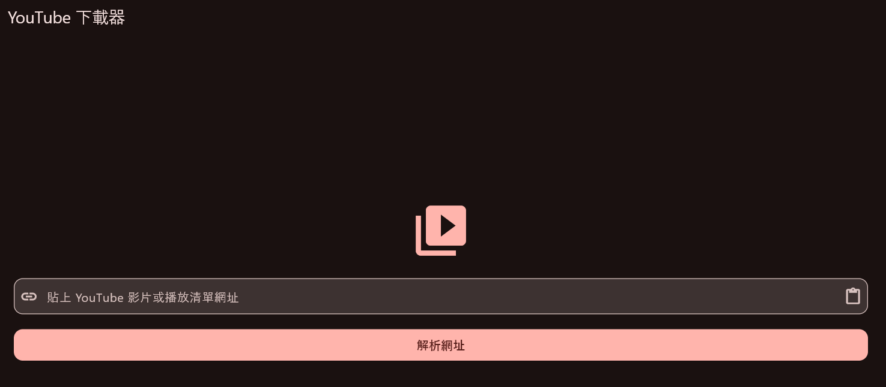
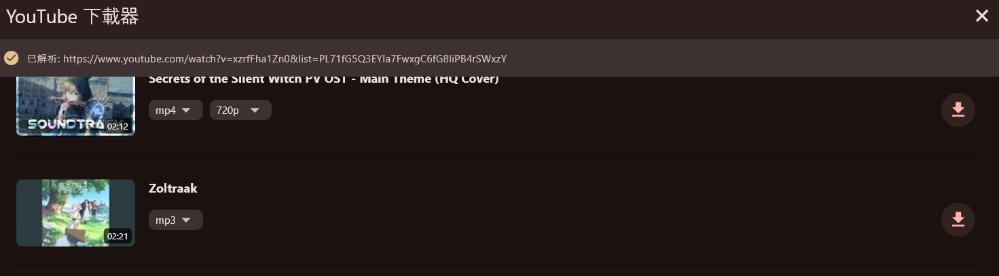
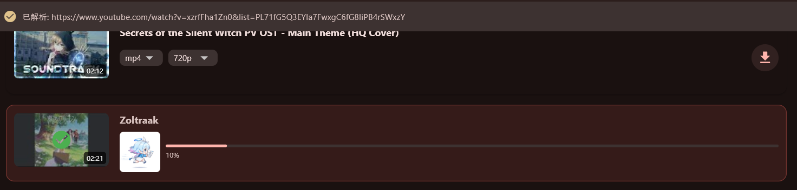
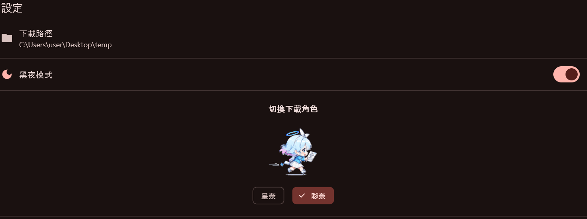

# YT Downloader

YouTube 影片／音樂下載器，採用前後端分離架構。

- **後端**：Python FastAPI + yt-dlp，提供影片資訊查詢、播放清單／頻道列表、串流代理下載與伺服器端下載。
- **前端**：Flutter 跨平台桌面應用，提供圖形化操作介面。

## 專案結構

```
yt_downloader/
├── backend/          # FastAPI 後端
├── frontend/         # Flutter 前端
└── img/              # 前端介面截圖
```

## 截圖

| 首頁輸入 | 影片列表與下載 |
|:---:|:---:|
|  |  |

| 下載進行 | 設定頁面 |
|:---:|:---:|
|  |  |

---

## Backend

基於 **FastAPI** 與 **yt-dlp**，支援串流代理下載（不佔用伺服器硬碟）與伺服器端下載。

### 技術棧

| 套件 | 用途 |
|------|------|
| FastAPI | Web 框架 |
| uvicorn | ASGI 伺服器 |
| yt-dlp | YouTube 資料提取與下載 |

### API 端點

#### `GET /playlist`
取得播放清單或頻道內的所有影片。

| 參數 | 型態 | 說明 |
|------|------|------|
| `url` | query | YouTube 播放清單或頻道網址 |
| `list` | query | 播放清單 ID（當 `url` 被截斷時作為備援） |

#### `GET /video/info`
取得單一影片的詳細資訊與可用格式。

| 參數 | 型態 | 說明 |
|------|------|------|
| `url` | query | YouTube 影片網址 |

回應中包含三種格式分類：
- `combined_formats` — 影音合一格式（如 18、22）
- `video_formats` — 純影片格式（無音軌）
- `audio_formats` — 純音訊格式

#### `GET /video/download`
串流代理下載指定格式的影片或音檔。  
不佔用伺服器磁碟，直接代理 YouTube 串流至客戶端。

| 參數 | 型態 | 說明 |
|------|------|------|
| `url` | query | YouTube 影片網址 |
| `format_id` | query | 格式 ID（從 `/video/info` 取得） |

#### `POST /video/download`
在伺服器端下載影片或轉換為 MP3，並存至設定目錄。

| 參數 | 型態 | 說明 |
|------|------|------|
| `video_id` | body | YouTube 影片 ID |
| `format` | body | `"mp4"` 或 `"mp3"` |
| `quality` | body | 畫質（如 `"720p"`、`"1080p"`） |

#### `GET /settings`
取得當前設定（下載路徑、黑夜模式、角色）。

#### `PUT /settings`
更新設定。

| 參數 | 型態 | 說明 |
|------|------|------|
| `download_path` | body | 下載目錄路徑（必填） |
| `dark_mode` | body | 布林值 |
| `character` | body | `"星奈"` 或 `"彩奈"` |

### 快速開始

#### 前置需求

- Python 3.11+
- Poetry（建議）或 pip
- FFmpeg（MP3 轉換需要）

#### 安裝與啟動

```bash
cd backend
poetry install
poetry run uvicorn main:app --host 127.0.0.1 --port 8000 --reload
```

或直接執行：

```bash
poetry run python main.py
```

服務啟動於 `http://127.0.0.1:8000`，自動 API 文件可於 `http://127.0.0.1:8000/docs` 檢視。

### 使用範例

```bash
# 取得播放清單
curl "http://127.0.0.1:8000/playlist?url=https://www.youtube.com/playlist?list=PLAYLIST_ID"

# 取得影片資訊
curl "http://127.0.0.1:8000/video/info?url=https://www.youtube.com/watch?v=VIDEO_ID"

# 串流下載（直接存擋）
curl -o "video.mp4" "http://127.0.0.1:8000/video/download?url=https://www.youtube.com/watch?v=VIDEO_ID&format_id=18"
```

---

## Frontend

跨平台 Flutter 桌面應用，提供直覺的 YouTube 下載操作介面。詳細說明請見 [frontend/README.md](frontend/README.md)。

### 開發模式

```bash
# 終端 1：啟動後端
cd backend
poetry run uvicorn main:app --host 127.0.0.1 --port 8000

# 終端 2：啟動前端
cd frontend
flutter run
```

> 前端內建 `BackendManager`，正式打包後會自動在背景啟動後端，開發模式需手動先啟動後端。

### 打包為單一應用程式

詳見 [frontend/README.md](frontend/README.md#打包為單一-windows-應用程式)。
